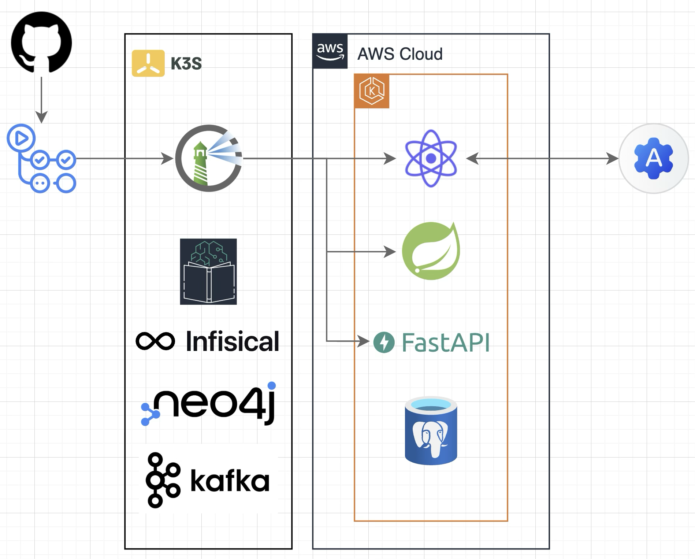

# 김동하 (Dongha Kim)

---

[ehdgk0900@gmail.com](mailto:ehdgk0900@gmail.com) · [Github](https://github.com/h4n9er)

## Skills

* Programming Language: C++, C#, Java, Python, PHP

* Framework: Spring
	
* Database: PostgreSQL, MySQL, MariaDB, SQLite
   
* DevOps: Docker, Kubernetes, Helm, AWS, Harbor

* Tools: Github, Infisical
 
## Early Projects

### [Moodmate](https://github.com/moodmate-ai/moodmate) - Diary service with AI analysis

* Designed and implemented Backend REST API with Spring Boot, PostgreSQL.
* Wrote docker-compose, Kubernetes configuration files and Helm chart.
* Deployed service via AWS EKS.
 
## Education

* University of Seoul, Republic of Korea
   * Bachelor of Science in ***Computer Science***, Aug 2026 (expected)